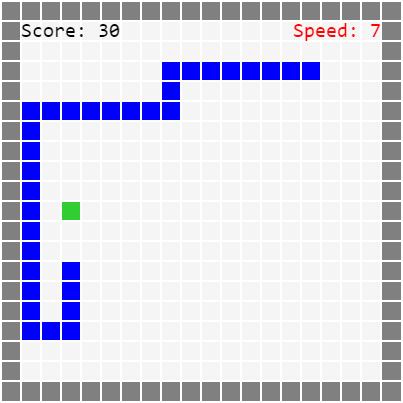
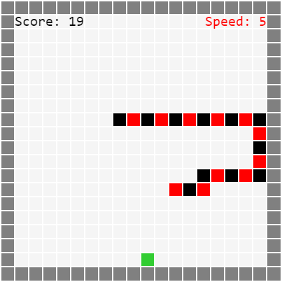

# Змейка на JavaScript

Данный репозиторий содержит браузерную реализацию игры "Змейка", написанную на языке JavaScript, стилизованную под портативную игровую консоль 90-х [Brick Game](https://ru.wikipedia.org/wiki/Brick_Game).

\
*Разноцветная змейка: выкл.*

\
*Разноцветная змейка: вкл.*

## Правила игры

Управляйте направлением движения змейки и съедайте как можно больше яблок. В верхней части игрового экрана расположены счет и скорость. За каждое съеденное яблоко счет увеличится. За каждые 10 яблок скорость игры возрастет. Если голова змейки укусит хвост или ударится о стену, игра закончится.

## Параметры игры

Файл `scripts/script.js` содержит логику игры, а также начальные параметры для изменения свойств и поведения у объектов игры:

- `canvasWidth = 400` - изменяет размер игрового экрана по вертикали на 400 пикселей;
- `canvasHeight = 400` - изменяет размер игрового экрана по горизонтали на 400 пикселей;
- `blockSize = 20` - изменяет длину стороны одного из квадратов на 20 пикселей;
- `speedMovesPerSecond = 4` - устанавливает начальную скорость движения змейки на 4 шага в секунду;
- `isSnakeMulticolored = true` - включает цветную раскраску змейки.

## Управление в игре

* Движение влево - стрелка *влево*.
* Движение вправо - стрелка *вправо*.
* Движение вверх - стрелка *вверх*.
* Движение вниз - стрелка *вниз*.
* Рестарт игры - клавиши *Enter*, *Ctrl*, *Esc*, *Пробел*.

## Системные требования

* **ОС:** Windows / MacOS / Linux / SteamOS / Android.
* **Веб-браузер:** Edge / Safari / Mozilla / Chrome / Brave.

## Запуск игры

### Вариант 1: Открытие через браузер

Откройте папку с проектом и откройте веб-браузер.

Перетащите мышкой файл `index.html` в открытое окно браузера, либо откройте данный файл через меню **Файл/Открыть** в самом браузере.

### Вариант 2: Запуск на веб-сервере

Убедитесь, что у вас установлен и включен один из веб-серверов (Apache либо Nginx).

Переместите файл `index.html` и папку `scripts` в директорию веб-сервера, где хранятся файлы HTML-разметки для использования их сервером. Например:

```
/var/www/
```

Откройте браузер и перейдите по соответствующему вашему серверу адресу (добавив к нему порт через двоеточие, если нужно). Пример адреса:

```
http://localhost:80/
```
